# K8S with NSX-T 2.5.x - PART 1
[Home Page](https://github.com/dumlutimuralp/k8s-with-nsx-t-2.5.x)

# Table of Contents
[Lab Infrastructure](#Lab-Infrastructure)  
[Current State](#Current-State)  

# Lab Infrastructure
[Back to Table of Contents](https://github.com/dumlutimuralp/k8s-with-nsx-t-2.5.x/tree/master/Part%202#Table-of-Contents)

Two ESX clusters are used for this demonstration. One is "ManagementEdge" cluster (ESX1 and ESX2) and the other is "WorkloadT" cluster (ESX3 and ESX4)

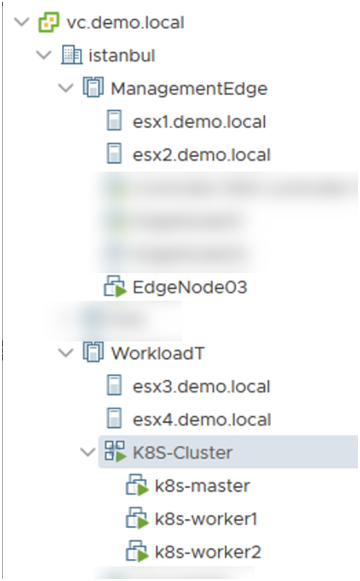

Note : NSX Manager cluster is running on a seperate cluster.

A single NSX-T Edge Transport Node  is used for this lab, named as EdgeNode03. As there are multiple solutions consuming the same NSX-T deployment, there are actually additional Edge VMs in this environment. The focus will be on EdgeNode03 VM only and it is hosted on ESX2. 

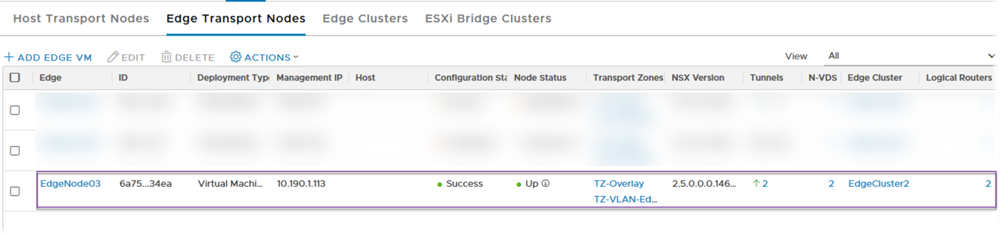

EdgeNode03 is part of EdgeCluster2, shown below. EdgeCluster here is an NSX-T construct. We are not referring to an ESX cluster here.

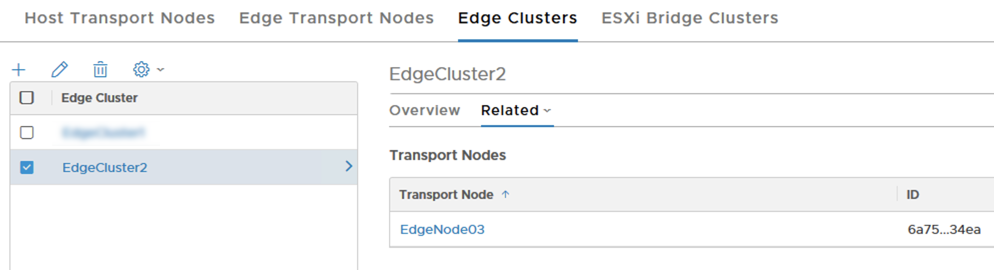

Connectivity of EdgeNode03 VM is shown below. As a reminder, ESX2 is <b>NOT</b> prepped for NSX-T. It is just hosting the NSX-T Edge VM. 

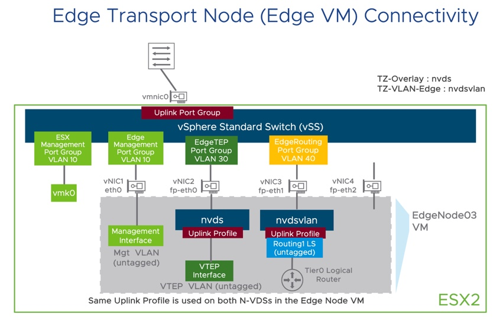

ESX2' s connectivity, from vCenter GUI, is shown below.

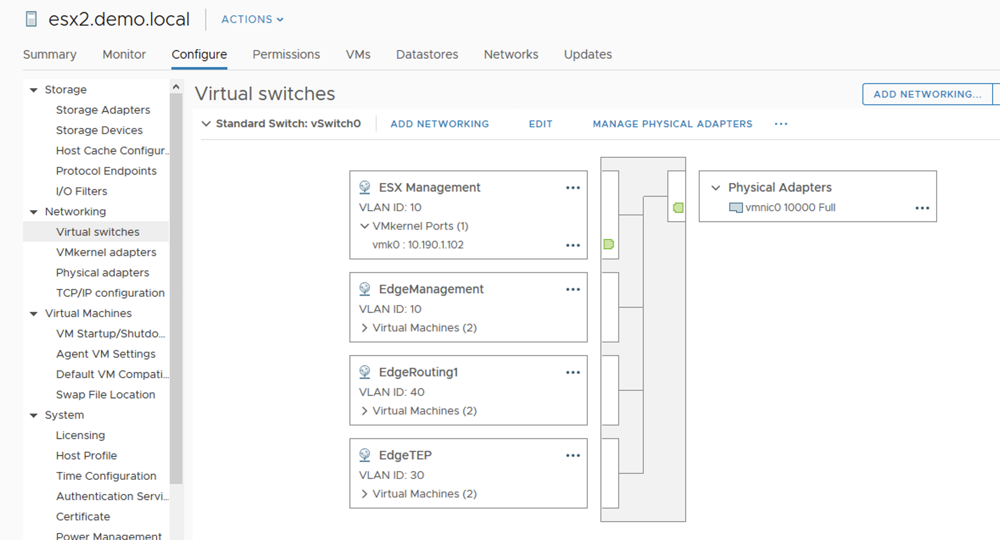

Two NSX-T Host Transport Nodes are used in this lab (shown below); which are ESX3 and ESX4 forming the "WorkloadT" cluster. 

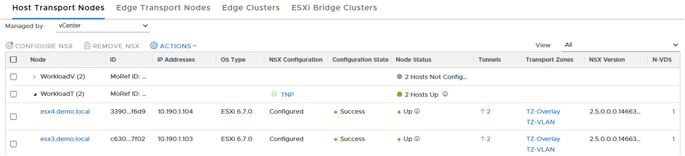

These two ESXs are prepped for NSX-T and they will be hosting the K8S Node VMs. Connectivity of ESX3/ESX4 is shown below.

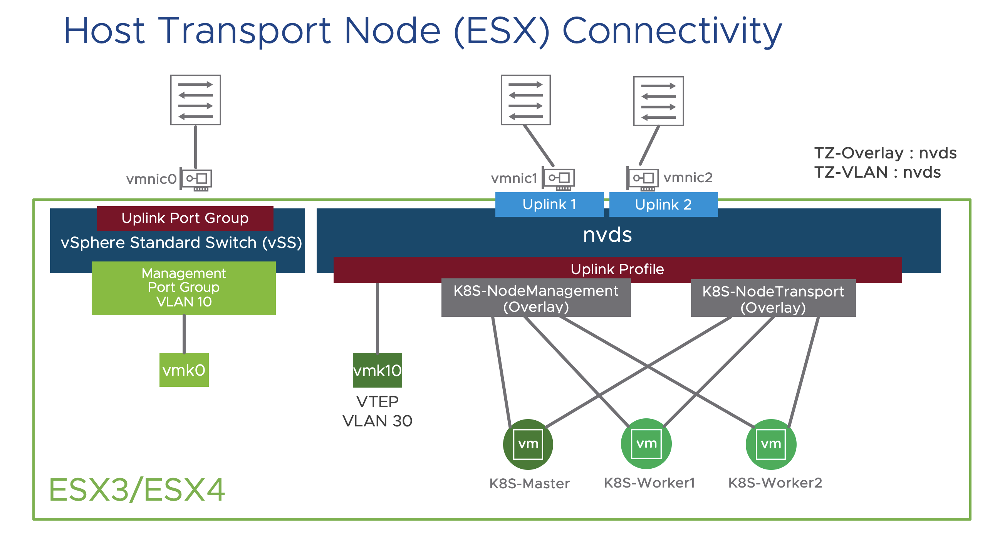

A screenshot from how the ESX connectivity looks like in vCenter GUI is shown below (for ESX3)

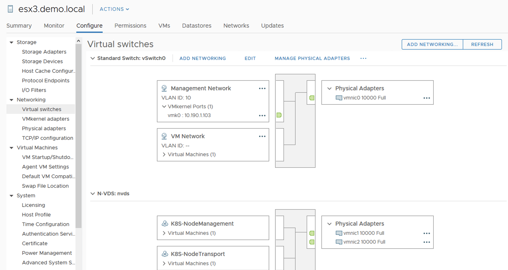

# Current State 
[Back to Table of Contents](https://github.com/dumlutimuralp/k8s-with-nsx-t-2.5.x/tree/master/Part%202#Table-of-Contents)

Currently the logical networking topology looks like below. 

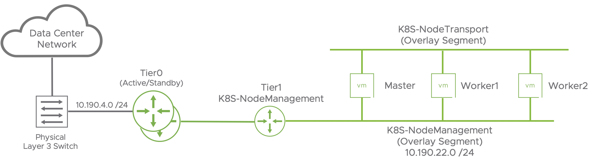

- Tier 0 and Tier 1 are running in EdgeNode03 VM.
- Tier0 is configured in active/standby mode, peering with underlying physical layer 3 switch through eBGP. 
- Tier 1 is configured for routing the K8S Node' s management network, which is an overlay segment configured as "K8S-NodeManagement" segment. 
- "K8S-NodeTransport" segment will only be used as a transport for K8S Pod connectivity. Hence it is not connected to Tier0 or Tier1. This will be explained in detail later on. 
- K8S Node VMs first vNIC will be connected to "K8S-NodeManagement" overlay segment and the second vNIC will be connected to "K8S-NodeTransport" overlay segment. First vNIC will be configured with an IP address from the respective subnet but second vNIC will <b>NOT</b> be configured with any IP as it will serve as a layer 2 transport only. 

NSX-T <v>simplified UI</b>, which corresponds to the <b>Policy API</b> of NSX-T, is used for this demonstration. Policy API is the declarative API interface for NSX consumption which was introduced in NSX-T 2.4.0. NSX still provides the option of using either Policy API or legacy MP API for different K8S clusters since it is a parameter in NCP config file which is configured per K8S cluster. However, moving forward, recommendation is to use Simplified UI for GUI operations (and Policy API for API operations)

<b>Simplified UI</b> is the left hand side box and the <b>Advanced UI</b> is the right hand side box in the below screenshot.

<b>Important Note : Any object configured through the simplified UI is still exposed in advanced UI. However any object configured through advanced UI never gets exposed in simplified UI. This is by design.</b>

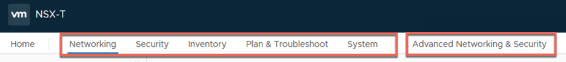

Below are the screenshots from the current NSX configuration in simplified UI.

The VLAN segment that is going to be connected to Tier0 is configured below. (as "OCP-K8S-Uplink_Segment") Notice there is no VLAN ID confgured for this segment since the underlying vDS Port Group ("EdgeRouting") will tag the traffic with the appropriate VLAN ID before sending it to the underlying physical network.

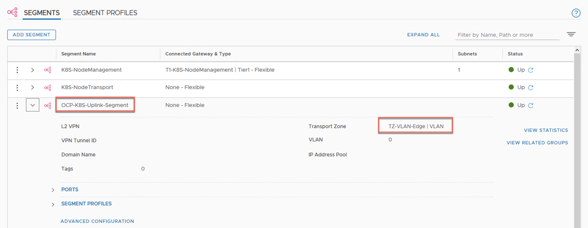

The Tier0 is configured below (as "T0-OCP-K8S"). The  edge cluster is chosen as "EdgeCluster2"

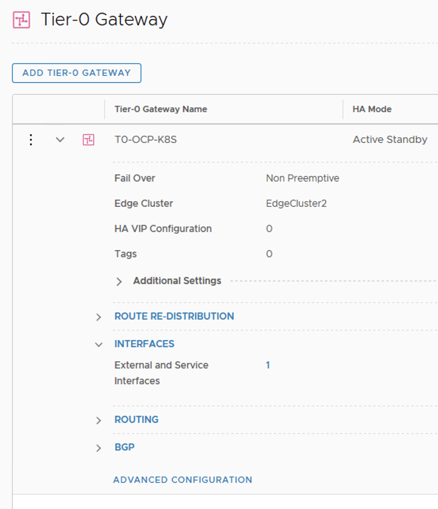

Previously configured uplink segment ("OCP-K8S-Uplink_Segment") is connected to the Tier0 as an "External" interface and the "EdgeNodge03".

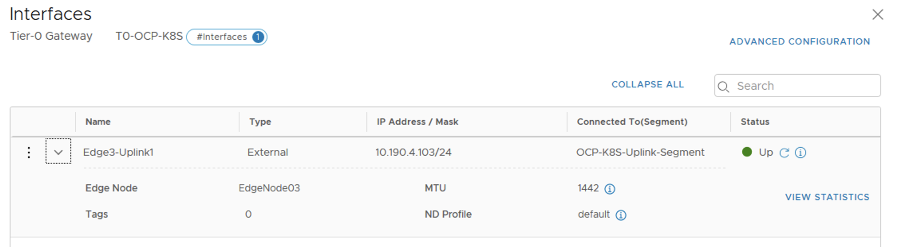

BGP is configured between Tier0 and physical layer switch however it is not mandatory. HA VIP with static routing can also be used.

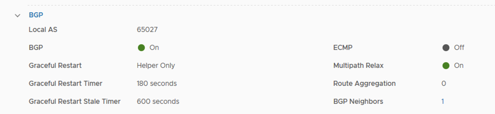

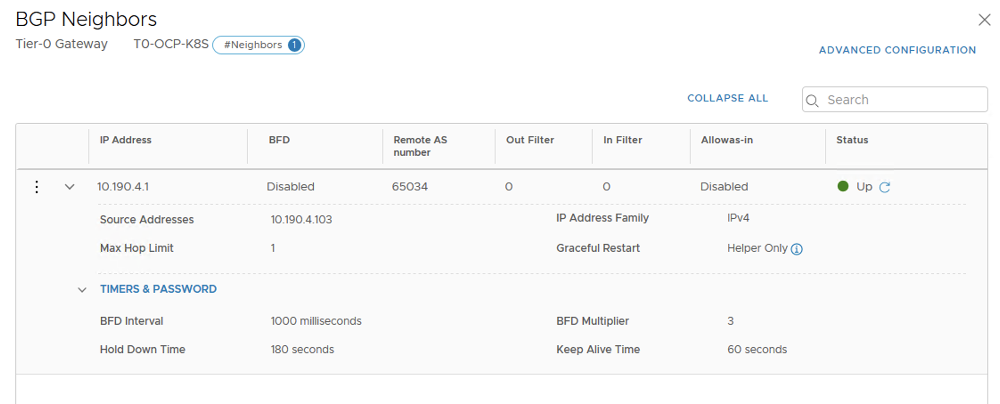

Tier1 is configured as "T1-K8S-NodeManagement" and connected to "T0-OCP-K8S" . Notice that its downlinks are enabled to be announced to Tier0. 

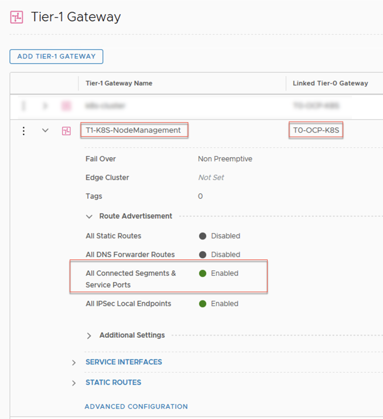

The "K8S-NodeManagement" segment is configured below and attached to the previously configured "T1-K8S-NodeManagement" Tier1 router. This is a new way of creating a segment and attaching it to Tier1 router. This is used to be done in Tier1 configuration itself. Now with simplified UI a segment is configured, associated with a subnet (by "Set Subnets" and then connected to the appropriate NSX Tier router on the same screen.

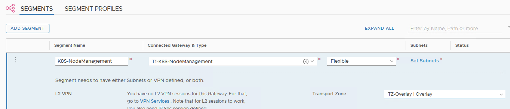

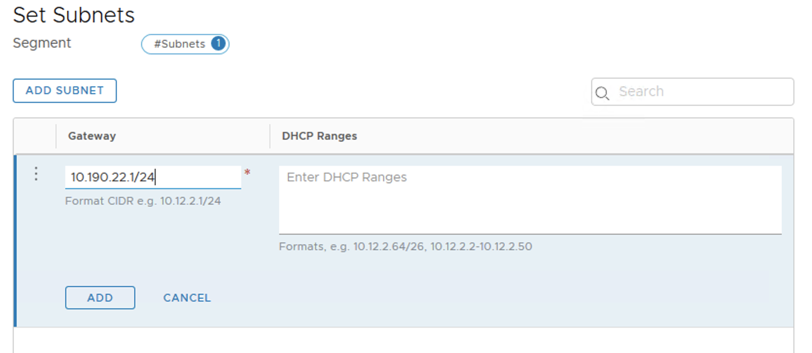

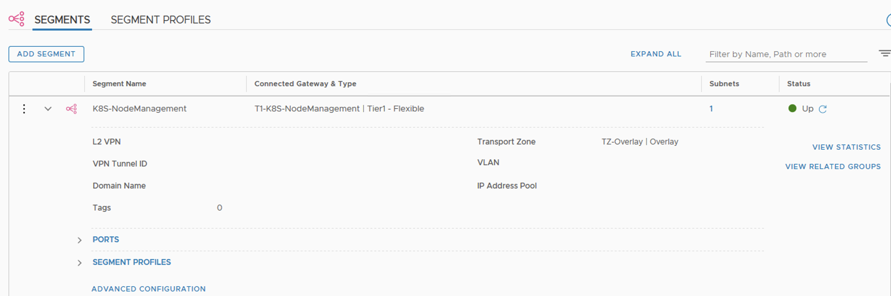

At this stage <b>K8S-NodeManagement segment subnet (10.190.22.0 /24) should be accessible from anywhere.</b>

The "K8S-NodeTransport" segment is configured below and as mentioned before <b>it is NOT configured with a subnet nor it is connected to any Tier0 or Tier1 router.</b>

