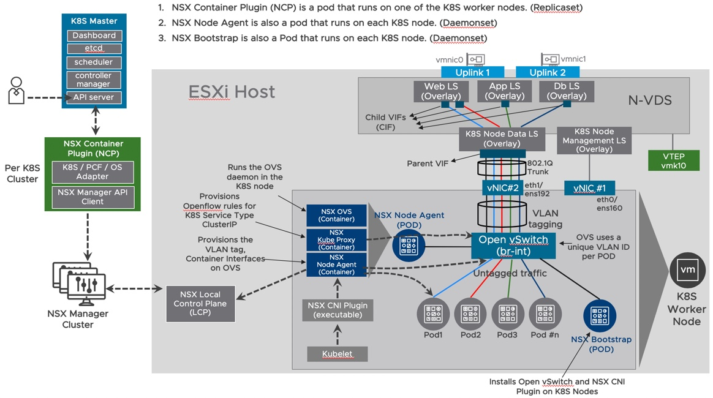
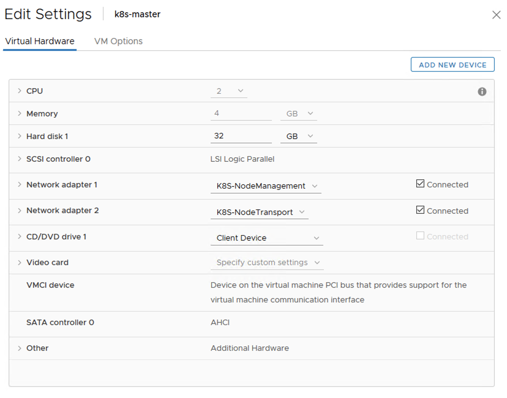

# NSX-T 2.5.x & K8S  - PART 2
[Home Page](https://github.com/dumlutimuralp/k8s-with-nsx-t-2.5.x)

# Table of Contents
[NSX Components in K8S Integration](#NSX-Components-in-K8S-Integration)   
[Ubuntu 18.04 Installation](#Ubuntu-18.04-Installation)  
[Docker Installation](#Docker-Installation)  
[K8S Installation](#K8S-Installation) 

# NSX Components in K8S Integration
[Back to Table of Contents](https://github.com/dumlutimuralp/k8s-with-nsx-t-2.5.x/tree/master/Part%202#Table-of-Contents)

This section focuses <b>only on the differences</b> between NSX-T 2.4 and NSX-T 2.5' s integration with K8S. For the detailed explanation of how the architecture looks like please refer to [Part 2](https://github.com/dumlutimuralp/k8s-with-nsx-t-2.4.x/blob/master/Part%202/README.md) of the prevous series (K8S with NSX-T 2.4.x).

* First difference with NCP 2.5 is that previously the admin had to login to each K8S node; then install and configure CNI Plugin and Open vSwitch (OVS) on each node seperately and also upgrade them manually. Now this is all managed and maintained by <b>a new K8S daemonset called "NSX-NCP-Bootstrap"</b>. "NSX-NCP-Bootstrap" Pod on each K8S node bootstraps the CNI Plugin and OVS on each node and attaches the selected ethernet interface on the respective node to the OVS.

* Second difference is <b>a new/additional container called "NSX-OVS" which is packaged within the well known "NSX Node Agent" Pod.</b> "NSX-OVS" container keeps the OVS daemon running on the K8S node. Which means the OVS daemon is run in the container' s IPC namespace. When someone logins to the K8S node itself he/she will not be able to perform OVS commands on the host itself.

Diagram highlighting the recent changes mentioned above with NCP 2.5 is shown below.

* Third difference is the manifest for all the NSX-T related components are now packaged in a single YAML file. Those are, NSX Container Plugin (NCP) as a deployment, plus all the config parameters with it (NCP.ini as configmap ), the NSX infrastructure' s own namespace "nsx-system" , the role based access control architecture that is applied to that namespace, NSX NCP Bootstrap daemonset and NSX Node Agent as daemonset.

* Fourth difference is the NSX-T Policy API support with K8S. As mentioned in Part 1, Policy API corresponds to Simplified UI in the NSX-T GUI. Usage of Policy API is presented as an option in the NCP config.

* Fifth difference is a new alternative topology option that is introduced. In all previous releases of NCP and NSX, each K8S namespace in a given K8S cluster used to have its own Tier1 Logical Router at all times. Source NAT for each K8S Namespace was configured on Tier 0 Logical Router and also  K8S Ingress and Service Type Load Balancer for each K8S cluster was implemented on a seperate/dedicated Tier 1 Logical Router. <b>With NSX-T 2.5, there is an option ("single_tier_topology") which is presented in NCP config. When that option is set to "True" then all these services are collapsed on a single Tier 1 Logical Router. </b> When a new namespace is provisioned that will be realized as a new downlink segment attached to that single Tier 1 Logical Router. All K8S Pods in the cluster also get Source NATed on that single Tier 1 Logical Router. K8S Ingress and Service Type Load Balancer VIPs are also realized on that single Tier 1 Logical Router. In this kind of a topology since stateful services are configured on Tier 1 layer, Tier 0 Logical Router can be run in active active mode which provides higher north south throughput. 

<b>Note :</b> If desired the topology can be simplified further as following; the Tier 1 Logical Router, the one which is already configured in this demonstration as "T1-K8S-NodeManagement", to which the K8S Nodes' management ethernet is connected, can be used as the single/collapsed Tier 1 Logical Router for all functions mentioned above. The related parameter to be used in NCP config is "top_tier_router" . When this parameter is set to the existing "K8S-NodeManagement" Tier 1 then that Tier 1 logical router will be the single/collapsed Tier 1 router to be used for the K8S cluster (for K8S Node Management, K8S namespace/POD connectivity with or without NAT, K8S services (Load Balancing), K8S Ingress (Layer 7 Load Balancing).

Below diagram shows the new optional topology that can be used with the introduction of NCP 2.5. 

As mentioned just above, this topology can be further simplified by using a collapsed Tier 1 by configuring the respective NCP config parameter ("top-tier-router") with an existing Tier 1 Router' s name/UUID in the NSX-T domain. In this lab these Tier 1 Logical Router' s kept seperate, meaning "top-tier-router" parameter is left blank hence NSX-T creates a new Tier 1 Logical Router for the K8S cluster. In the above diagram Tier 1 with Load Balancer runs in active/standby mode (meaning that it has both SR and DR component) however the other Tier1 for K8S Node Management connectivity only runs the DR component since stateful services (NAT, LB etc.) is <b>NOT</b> used on that Tier 1.

* Sixth difference is the K8S Network Policy driven NSX-T DFW rules can be placed in the "Application" category of the DFW in the simplified UI. (with three different options as allow cluster, allow namespace, none)  This is also presented as a new parameter in NSX Config (as "baseline_policy_type")

* There are additional new parameters introduced in NCP config which will be explained in the upcoming parts.

# Ubuntu 18.04 Installation
[Back to Table of Contents](https://github.com/dumlutimuralp/k8s-with-nsx-t-2.5.x/tree/master/Part%202#Table-of-Contents)

For this lab three VM' s will be configured. Below is a screenshot from one of the VM' s hardware configuration for Ubuntu 18.04 OS 64 bit.

Note : As mentioned in Part 1; two network interfaces will be used on each Ubuntu node.

For Ubuntu 18.04 installation please refer to [this article](https://www.linuxtechi.com/ubuntu-18-04-lts-desktop-installation-guide-screenshots/) which outlines the steps needed in a simplified flow structure.

Additional steps needed to be followed to prepare the Ubuntu OS for Docker and K8S installation. <b>Repeat Steps 1-5 below for all three nodes.</b> In this lab "k8s-master" , "k8s-worker1" and "k8s-worker2" are configured. (Either use sudo or escalate to shell for root privileges)

1. Configure a unique hostname :

<pre><code>
sudo hostnamectl set-hostname k8s-master
</code></pre>

2. Configure the hosts file

<pre><code>
sudo vi /etc/hosts
127.0.1.1 k8s-master
</code></pre>

Not all nodenames are included in the hosts file of each node, as DNS is used in this lab. If DNS does not exist then since each node should be able to access each other by name, all nodenames and IP addresses must be included in the hosts file on each node.

3. Check the interfaces on the node

<pre><code>
vmware@k8s-master:~$ <b>ip link show</b>
1: lo: <LOOPBACK,UP,LOWER_UP> mtu 65536 qdisc noqueue state UNKNOWN mode DEFAULT group default qlen 1000
    link/loopback 00:00:00:00:00:00 brd 00:00:00:00:00:00
2: ens160: <BROADCAST,MULTICAST,UP,LOWER_UP> mtu 1500 qdisc mq state UP mode DEFAULT group default qlen 1000
    link/ether 00:50:56:b4:28:b8 brd ff:ff:ff:ff:ff:ff
3: ens192: <BROADCAST,MULTICAST,UP,LOWER_UP> mtu 1500 qdisc mq master ovs-system state UP mode DEFAULT group default qlen 1000
    link/ether 00:50:56:b4:0a:52 brd ff:ff:ff:ff:ff:ff
</code></pre>

4. Configure a static IP on the first interface

<pre><code>
sudo vi /etc/netplan/50-cloud-init.yaml
</code></pre>

Sample Config : 

<pre><code>
network:
  version: 2
  renderer: networkd
  ethernets:
    <b>ens160</b>:
      dhcp4: no
      addresses:
        - 10.190.22.10/24
      gateway4: 10.190.22.1
      nameservers:
          search: [demo.local]
          addresses: [192.168.1.185]
</code></pre>

Apply Changes :

<pre><code>
sudo netplan apply
</code></pre>

Verify Changes : 

<pre><code>
vmware@k8s-master:~$ <b>ip address show dev ens160</b>
2: ens160: <BROADCAST,MULTICAST,UP,LOWER_UP> mtu 1500 qdisc mq state UP group default qlen 1000
    link/ether 00:50:56:b4:28:b8 brd ff:ff:ff:ff:ff:ff
    inet <b>10.190.22.10/24</b> brd 10.190.22.255 scope global ens160
       valid_lft forever preferred_lft forever
    inet6 fe80::250:56ff:feb4:28b8/64 scope link
       valid_lft forever preferred_lft forever
vmware@k8s-master:~$
</code></pre>

There should not be any IPv4 addresses configured on ens192 interface, which can be verified as below.

<pre><code>
vmware@k8s-master:~$ <b>ip address show dev ens192</b>
3: ens192: <BROADCAST,MULTICAST,UP,LOWER_UP> mtu 1500 qdisc mq master ovs-system state UP group default qlen 1000
    link/ether 00:50:56:b4:0a:52 brd ff:ff:ff:ff:ff:ff
    inet6 fe80::250:56ff:feb4:a52/64 scope link
       valid_lft forever preferred_lft forever
vmware@k8s-master:~$
</code></pre>

5. Turn off Swap on each node

<pre><code>
sudo swapoff -a
</code></pre>

Comment out the line with swap in the "fstab" configuration

<pre><code>
sudo vi /etc/fstab
</code></pre>

K8S requires the SWAP to be disabled => https://github.com/kubernetes/kubernetes/blob/master/CHANGELOG-1.8.md#before-upgrading  There is a great blog article about why this step is needed => https://frankdenneman.nl/2018/11/15/kubernetes-swap-and-the-vmware-balloon-driver/  
How to do it on Ubuntu => https://www.tecmint.com/disable-swap-partition-in-centos-ubuntu/

To be compliant with the versions listed iin [NCP 2.5 Release Notes](https://docs.vmware.com/en/VMware-NSX-T-Data-Center/2.5/rn/NSX-Container-Plugin-25-Release-Notes.html#sysreqs) certain version of K8S will be installed. For this lab K8S 1.14 will be installed. To check the compatibility of K8S <-> Docker [this URL](https://github.com/kubernetes/kubernetes/blob/master/CHANGELOG-1.14.md#external-dependencies) can be reviewed. For this lab Docker 18.06 will be installed.

# Docker Installation
[Back to Table of Contents](https://github.com/dumlutimuralp/k8s-with-nsx-t-2.5.x/tree/master/Part%202#Table-of-Contents)

* Escalate to root in the shell (if not already)

<pre><code>
vmware@k8s-master:~$ sudo -H bash
[sudo] password for vmware:
root@k8s-master:/home/vmware#
</code></pre>

### Install GPG for Docker Repository

Ensure the integrity and authenticity of the images that are downloaded from Docker Hub. GPG is based on Public Key Cryptogragphy (more info here : https://www.gnupg.org/)

<pre><code>
curl -fsSL https://download.docker.com/linux/ubuntu/gpg | sudo apt-key add -
</code></pre>

### Add Docker Repository to APT Source

Configure Docker Hub as the APT source rather than the Ubuntu 18.04 repository

<pre><code>
sudo add-apt-repository "deb [arch=amd64] https://download.docker.com/linux/ubuntu $(lsb_release -cs) stable"
</code></pre>

### Update Docker Packages

<pre><code>
sudo apt-get update
</code></pre>

### Check Cached Docker-CE Package in Repository

<pre><code>
vmware@k8s-master:~$<b>sudo apt-cache policy docker-ce</b>
docker-ce:
  Installed: 18.06.0~ce~3-0~ubuntu
  Candidate: 5:19.03.5~3-0~ubuntu-bionic
  Version table:
     5:19.03.5~3-0~ubuntu-bionic 500
        500 https://download.docker.com/linux/ubuntu bionic/stable amd64 Packages
     5:19.03.4~3-0~ubuntu-bionic 500
------ OUTPUT OMITTED ------
------ OUTPUT OMITTED ------
------ OUTPUT OMITTED ------
     18.06.0~ce~3-0~ubuntu 500
        500 https://download.docker.com/linux/ubuntu bionic/stable amd64 Packages
        100 /var/lib/dpkg/status
     18.03.1~ce~3-0~ubuntu 500
        500 https://download.docker.com/linux/ubuntu bionic/stable amd64 Packages
vmware@k8s-master:~$
</code></pre>

### Install Docker CE 18.0.6.0 

<pre><code>
sudo apt-get install docker-ce=18.06.0~ce~3-0~ubuntu
</code></pre>

Note : To make sure of an "apt-get update" not to break the compatibility between Docker and K8S, it would be a good practice to apply apt-mark hold on the related components. For example by using "apt-mark hold docker-ce".

* Verify Docker version

<pre><code>
vmware@k8s-master:~$ <b>sudo docker version</b>
[sudo] password for vmware:
Client:
 Version:           <b>18.06.0-ce</b>
 API version:       1.38
 Go version:        go1.10.3
 Git commit:        0ffa825
 Built:             Wed Jul 18 19:09:54 2018
 OS/Arch:           linux/amd64
 Experimental:      false

Server:
 Engine:
  Version:          <b>18.06.0-ce</b>
  API version:      1.38 (minimum version 1.12)
  Go version:       go1.10.3
  Git commit:       0ffa825
  Built:            Wed Jul 18 19:07:56 2018
  OS/Arch:          linux/amd64
  Experimental:     false
vmware@k8s-master:~$
</code></pre>

* Verify Docker is running (if not, "sudo systemctl enable docker")

<pre><code>
vmware@k8s-master:~$ <b>sudo systemctl status docker</b>
● docker.service - Docker Application Container Engine
   Loaded: loaded (/lib/systemd/system/docker.service; enabled; vendor preset: enabled)
   Active: <b>active (running)</b> since Tue 2019-12-03 21:13:40 UTC; 1 weeks 2 days ago
     Docs: https://docs.docker.com
 Main PID: 1013 (dockerd)
    Tasks: 290
   CGroup: /system.slice/docker.service
           ├─ 1013 /usr/bin/dockerd -H fd://
           ├─ 1200 docker-containerd --config /var/run/docker/containerd/containerd.toml
           ├─ 2762 docker-containerd-shim -namespace moby -workdir /var/lib/docker/containerd/daemon/io.containerd.runtime.v1.linux/moby/6b70
           ├─ 2766 docker-containerd-shim -namespace moby -workdir /var/lib/docker/containerd/daemon/io.containerd.runtime.v1.linux/moby/b041
           ├─ 2767 docker-containerd-shim -namespace moby -workdir /var/lib/docker/containerd/daemon/io.containerd.runtime.v1.linux/moby/be92
           ├─ 2779 docker-containerd-shim -namespace moby -workdir /var/lib/docker/containerd/daemon/io.containerd.runtime.v1.linux/moby/031a
           ├─ 2839 /pause
           ├─ 2874 /pause
           ├─ 2875 /pause
           ├─ 2876 /pause
           ├─ 2987 docker-containerd-shim -namespace moby -workdir /var/lib/docker/containerd/daemon/io.containerd.runtime.v1.linux/moby/fb6f
           ├─ 3012 kube-scheduler --bind-address=127.0.0.1 --kubeconfig=/etc/kubernetes/scheduler.conf --leader-elect=true
           ├─ 3028 docker-cont
------ OUTPUT OMITTED ------
------ OUTPUT OMITTED ------
------ OUTPUT OMITTED ------
</code></pre>

# K8S Installation
[Back to Table of Contents](https://github.com/dumlutimuralp/k8s-with-nsx-t-2.5.x/tree/master/Part%202#Table-of-Contents)

### Install GPG for Google Repository

<pre><code>
curl -s https://packages.cloud.google.com/apt/doc/apt-key.gpg | sudo apt-key add
</code></pre>

### Add Google Repository to APT Source

<pre><code>
sudo apt-add-repository "deb http://apt.kubernetes.io/ kubernetes-xenial main"
</code></pre>

### Check Cached kubelet packages in Repository 

<pre><code>
vmware@k8s-master:~$ <b>sudo apt-cache policy kubelet</b>
kubelet:
  Installed: <b>1.14.7-00</b>
  Candidate: 1.17.0-00
  Version table:
     1.17.0-00 500
        500 http://apt.kubernetes.io kubernetes-xenial/main amd64 Packages
     1.16.4-00 500
        500 http://apt.kubernetes.io kubernetes-xenial/main amd64 Packages
     1.16.3-00 500
        500 http://apt.kubernetes.io kubernetes-xenial/main amd64 Packages
     1.16.2-00 500
        500 http://apt.kubernetes.io kubernetes-xenial/main amd64 Packages
------ OUTPUT OMITTED ------
------ OUTPUT OMITTED ------
------ OUTPUT OMITTED ------
     1.14.8-00 500
        500 http://apt.kubernetes.io kubernetes-xenial/main amd64 Packages
     <b>1.14.7-00 500</b>
        500 http://apt.kubernetes.io kubernetes-xenial/main amd64 Packages
        100 /var/lib/dpkg/status
------ OUTPUT OMITTED ------
------ OUTPUT OMITTED ------
------ OUTPUT OMITTED ------
vmware@k8s-master:~$
</code></pre>

Same check can be done for "kubectl" and "kubeadm"

### Install Kubernetes

* Install kubernetes on master node 

<pre><code>
sudo apt-get install -y kubectl=1.14.7-00 kubeadm=1.14.7-00 kubelet=1.14.7-00
</code></pre>

At the end of the installation process an output similar too the below one should be observed.

<pre><code>
Your Kubernetes control-plane has initialized successfully!

To start using your cluster, you need to run the following as a regular user:

  <b>mkdir -p $HOME/.kube
  sudo cp -i /etc/kubernetes/admin.conf $HOME/.kube/config
  sudo chown $(id -u):$(id -g) $HOME/.kube/config</b>

<b>You should now deploy a pod network to the cluster.</b>
Run "kubectl apply -f [podnetwork].yaml" with one of the options listed at:
  https://kubernetes.io/docs/concepts/cluster-administration/addons/

Then <b>you can join any number of worker nodes by running the following on each as root:</b>

   kubeadm join 10.190.22.10:6443 --token txy6bc.o9lpnabsxin9vavyfa \
    --discovery-token-ca-cert-hash sha256:9824b49e691c3ab0dcdeb97b26a57bbb7abf619393a332786a336f2ff5b560e0
</code></pre>

* Check the cluster state 

At this stage kubelet will provide the following error , which can be seen in the output of "kubectl describe nodes" output.

<pre><code>
  Ready            False   Tue, 03 Dec 2019 21:27:26 +0000   Tue, 03 Dec 2019 21:19:26 +0000   KubeletNotReady  <b>runtime network not ready: NetworkReady=false reason:NetworkPluginNotReady message:docker: network plugin is not ready: cni config uninitialized</b>
</code></pre>

The node will show up in "NotReady" state <b>since the CNI plugin is not installed on any node yet.</b> This is expected.

<pre><code>
vmware@k8s-master:~$ <b>kubectl get nodes</b>
NAME          STATUS      ROLES    AGE   VERSION
k8s-master    <b>NotReady</b>    master   10m    v1.14.7
vmware@k8s-master:~$
</code></pre>

* Join other nodes to the K8S cluster

Use the command mentioned above on "k8s-worker1" and "k8s-worker2" to join them to the K8S cluster.

<pre><code>
vmware@k8s-worker1:~$ kubeadm join 10.190.22.10:6443 --token txy6bc.o9lpnabsxin9vavyfa \
    --discovery-token-ca-cert-hash sha256:9824b49e691c3ab0dcdeb97b26a57bbb7abf619393a332786a336f2ff5b560e0
</code></pre>

<b>Note : All nodes will still be in "NOTREADY" state. This is expected.</b>

