# NSX-T 2.5.x & K8S  - PART 3
[Home Page](https://github.com/dumlutimuralp/k8s-with-nsx-t-2.5.x)

# Table of Contents
[Configuring NSX Objects for K8S](#Configuring-NSX-Objects-for-K8S)  
[NSX Downloadables for K8S](#NSX-Downloadables-for-K8S)  
[Content of Manifest File](#Content-of-Manifest-File)

# Configuring NSX Objects for K8S
[Back to Table of Contents](https://github.com/dumlutimuralp/k8s-with-nsx-t-2.5.x/tree/master/Part%203#Table-of-Contents)

## Tagging the Segment Ports for K8S Nodes

In this section the ports of the "K8S-NodeTransport" segment, to which the Kubernetes Nodes second vNIC is connected to, will be configured with specific scopes as "ncp/cluster" , "ncp/node_name" and with specific tags as "k8s-cluster" and K8S Node hostname.

Navigate to "Networking -> Segments" in the NSX-T Simplified UI and then CLICK three dots on the left of the  "K8S-NodeTransport" segment and then click edit in the pop up menu. Click on the right arrow next to where it says "Ports" and then click on the number "3" on the right to edit the tagging of the ports. 

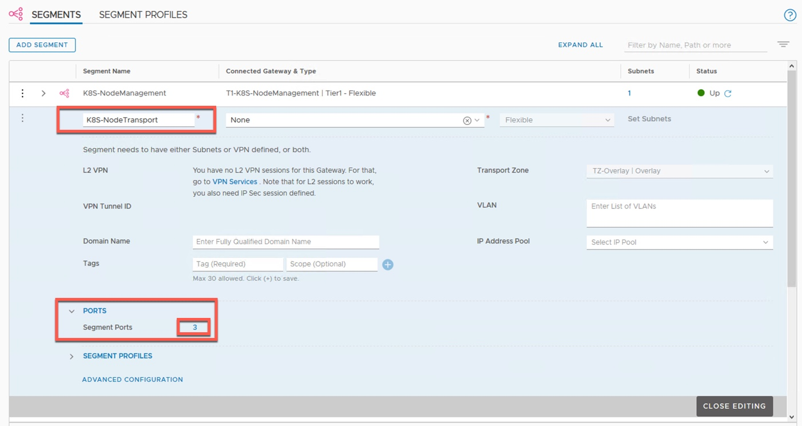

When the ports screen come up then click on three dots on the left of the port on top, and then click on edit, this will bring up the settings screen for that segment port.

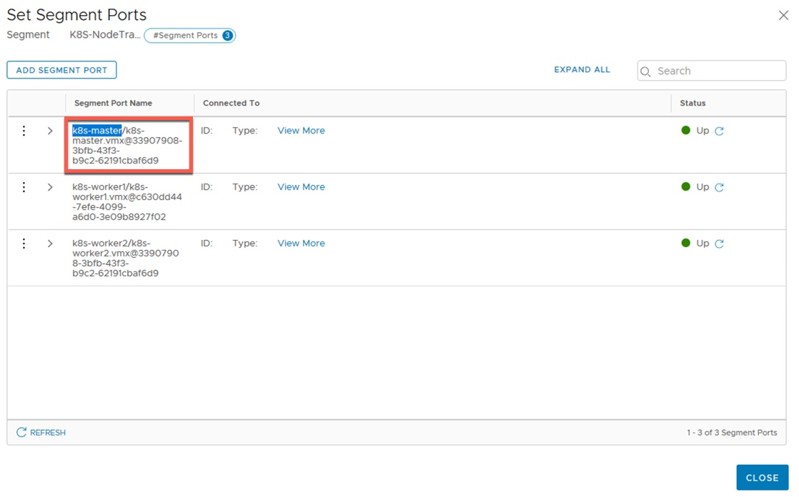

Configure the tag and scope as shown below.

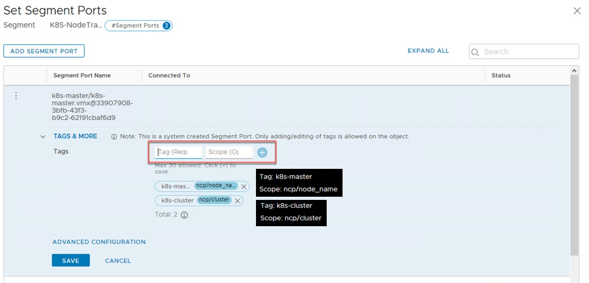

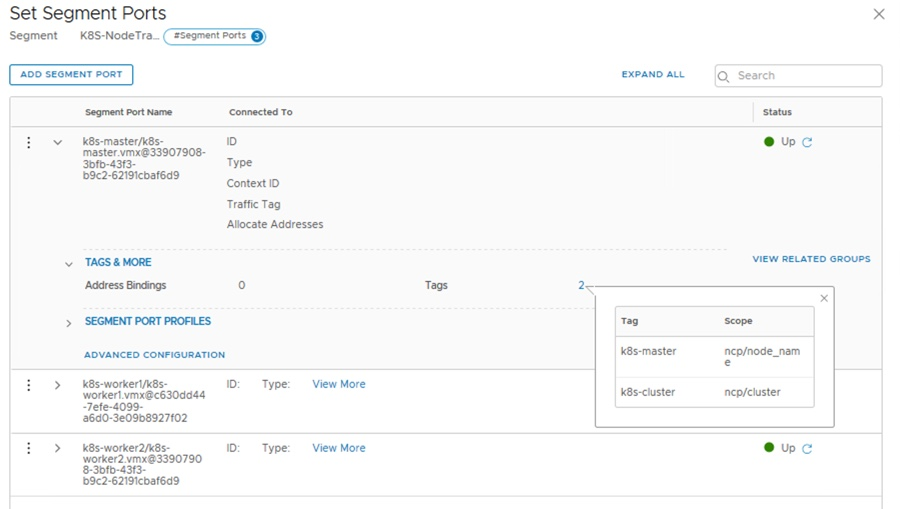

Repeat the steps for the remaining nodes. the nodename should match the tag for the scope "ncp/node_name".

Note#1 : The tag should match the node name which should match the hostname of the Ubuntu node, since that specific hostname will be used by Kubernetes as the node name.

Note#2 : If the admin changes the Kubernetes node name, then the tag ncp/node_name should also be updated and NCP needs to be restarted. Once Kubernetes is installed, "kubectl get nodes" can be used to provide the node names in the output. The tags should be added to the segment port before that node gets added to the K8S cluster by using the "kubeadm join" command. Otherwise, the K8S Pods on the new node will not have network connectivity. In case of tags being incorrect or missing, then to fix the issue, correct tags should be applied and NCP should be restarted.

## Configuring IP Address Pools and IP Address Blocks

Navigate to "Networking -> IP Address Pools -> IP Address Pools (again)" and then configure an IP address pool "K8S-LB-POOL" as following; this pool will be used for the IP address assignment of the K8S Ingress or for each service of K8S Service Type LoadBalancer.

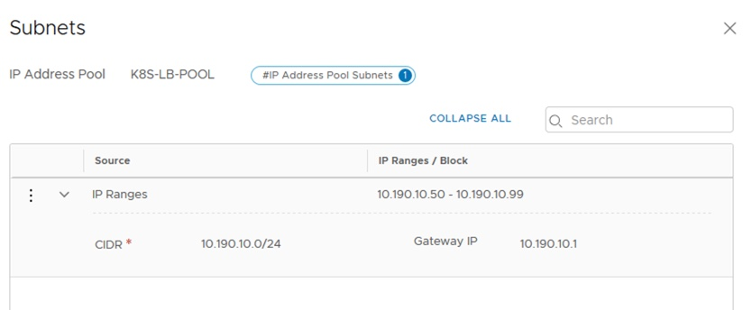

Navigate to "Networking -> IP Address Pools -> IP Address Pools (again)" and then configure an IP address pool "K8S-NAT-POOL" as following; this pool will be used for source NATing the K8S Pods in the namespaces. For each namespace an individual SNAT IP will be picked from this pool. 

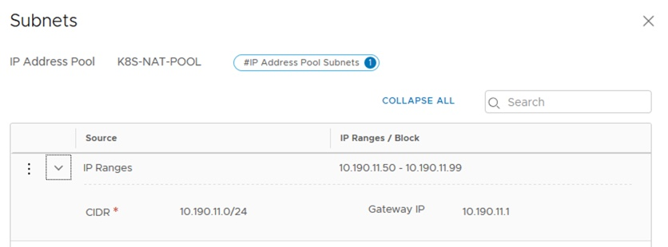

Navigate to "Networking -> IP Address Pools -> IP Address Blocks" and then configure the two IP address blocks shown below. 

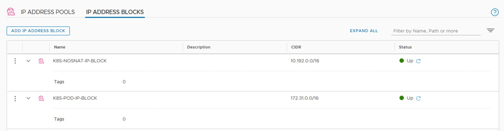

"K8S-POD-IP-BLOCK" is provisioned as a /16 subnet ("K8S-POD-IP-BLOCK" - 172.31.0.0/16). Whenever a developer creates a new K8S namespace, then this IP Block will be carved out by /24 chunk and a /24 subnet based IP pool will be created in NSX-T automatically. That /24 subnet based IP pool will be assigned to the respective namespace and whenever Pods are created in that namespace, then each POD will pick an IP address from that /24 subnet. (Each namespace which gets an IP Pool out of this "K8S-POD-IP-BLOCK" will be SNATed to an IP address which gets picked from the "K8S-NAT-POOL" configured earlier)

"K8S-NOSNAT-IP-BLOCK" is also provisioned as a /16 subnet ("K8S-POD-IP-BLOCK" - 10.192.0.0/16) . As the name suggests this IP Block is used for namespaces which will NOT be source NATed. Whenever a developer creates a new K8S namespace with the K8S annonation of " ncp/no_snat: "true" " in the manifest (yaml file), then this IP Block will be used and then this IP Block will be carved out by /24 chunk and a /24 subnet based IP pool will be created in NSX-T automatically. That /24 subnet based IP pool will be assigned to the respective namespace and whenever Pods are created in that namespace, then each POD will pick an IP address from that /24 subnet.

<b>Note :</b> NSX-T supports configuring a persistent SNAT IP per K8S namespace or per K8S service by using native K8S annotations. This provides granular operations for Pods to access a physical database for instance. This is not covered in this demonstration.

## Configuring Firewall Sections

Two new sections will be configured in the NSX-T distributed firewall rule base. Any K8S related firewall rule will be configured between these sections. 

Navigate to "Security -> East-West Security Distributed Firewall -> Category Specific Rules -> Environment" and then click on "+ Add Policy " and then give it a name like "K8S-Begin". Configure one more section by clicking on "+ Add Policy" and then give it a name like "K8S-End". Drag and drop as needed to make sure these sections show up as below. The K8S network policy driven firewall rules will land in between these sections.

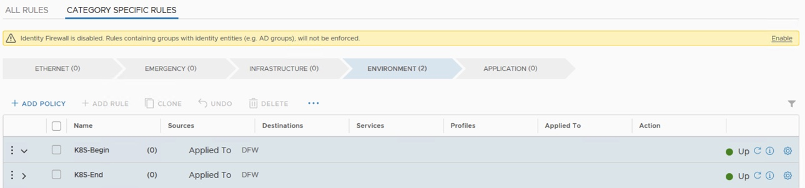

## Capturing the NSX-T Object Names 

In this step the object UUID of the NSX-T objects which will be consumed by K8S need to be captured and noted. For that what needs to be done is <b>clicking on the three dots on the left of the respective object in the NSX-T UI and select "Copy path to clipboard". </b> This action copies the whole API path of the object in which the object UUID can be found.

Let' s do this for Tier 0 Gateway and also for one of the IP address pools.

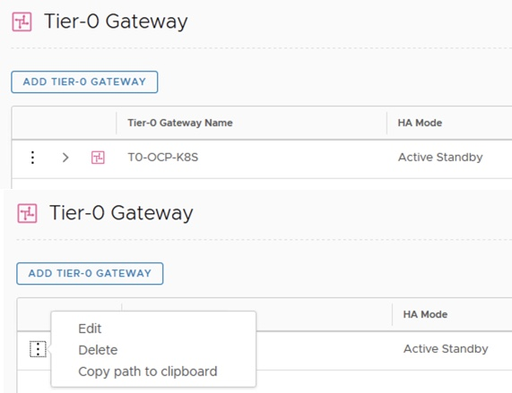

<b>When "Copy path to clipboard" is selected and the content is pasted to a notepad file , in this lab the output appears like this -> "/infra/tier-0s/T0-OCP-K8S". This means that object UUID is "T0-OCP-K8S".</b> Note that with Policy API, the UUID is the object name itself in most cases. 

<b>Important Note :</b> If the NSX-T object is renamed later on, the object UUID will still stay the same as specified in the object creation time. Hence double checking the UUID as shown above is an important task.

Repeat the above step for all the IP address pools, IP address blocks, firewall sections and make a note of the object UUID. (For firewall section it will be long string of characters)

# NSX Downloadables for K8S
[Back to Table of Contents](https://github.com/dumlutimuralp/k8s-with-nsx-t-2.5.x/tree/master/Part%203#Table-of-Contents)

NSX Container Plug-in for Kubernetes and Cloud Foundry - Installation and Administration Guide, published [here](https://docs.vmware.com/en/VMware-NSX-T-Data-Center/2.5/ncp-kubernetes/GUID-FB641321-319D-41DC-9D16-37D6BA0BC0DE.html), guides the user on the installation steps of the NSX components on a K8S cluster. In this article a more simplified and explanatory view is provided.

Kubernetes related NSX files can be downloaded from NSX-T download page at my.vmware.com (shown below)

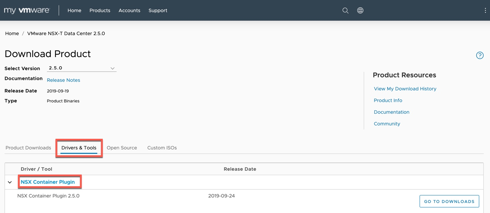

When "Go To Downloads" is clicked the details of the content can be reviewed in the following page (below)

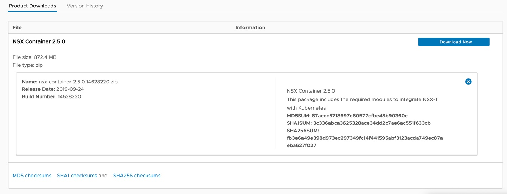

Once the .zip file is downloaded and extracted the content is as below.

The breakdown of the content is following :

* Kubernetes : This folder contains the unified manifest file (Yaml) and container image (.tar) for RHEL and Ubuntu operating systems. The same container image is used for NSX Node Agent, NSX Kube Proxy, NSX OVS and NSX Dummy containers. (Note that there is a container image also for Photon operating system which is used on nodes in Pivotal Application Services (PAS) solution)

* Openshift : This folder contains the unified manifest file (.yaml) for Openshift baremetal nodes andd Openshift virtual machine nodes.

* Open vSwitch : This folder contains the Open vSwitch package for various operating systems. 

* PAS : This folder contains the Pivotal Application Services (PAS) specific installation file. 

* Scripts : As the name suggests this folder contains the scripts to clean all the K8S related objects in NSX-T objecct database in a policy API based or management API based NSX-T environment in the event of a K8S cluster decommission process.

Since in this environment Ubuntu is the operating system for K8S nodes, "nsx-ncp-ubuntu-2.5.0.14628220.tar" and "ncp-ubuntu.yaml" will be used. 

Let' s look at the manfiest file "ncp-ubuntu.yaml" in more detail now.

