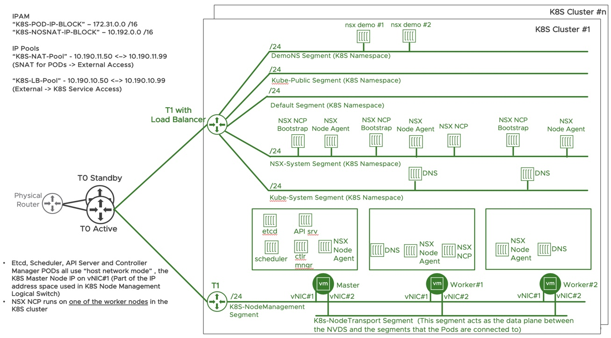
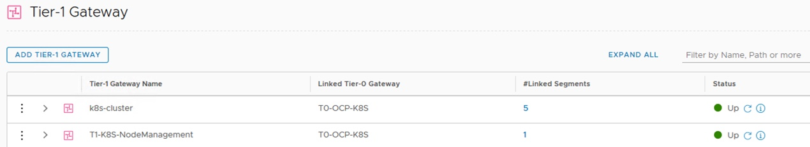
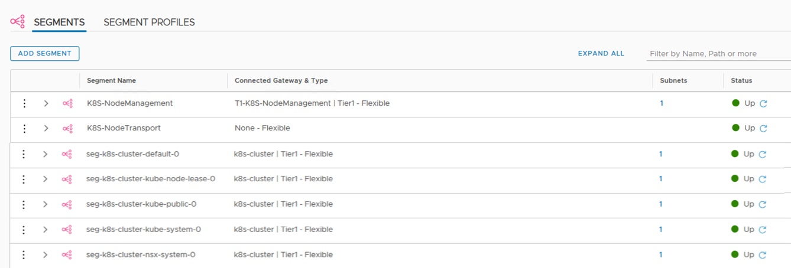
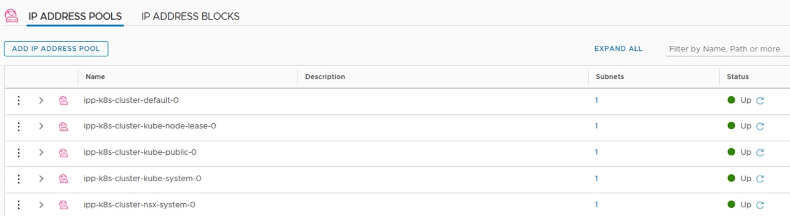
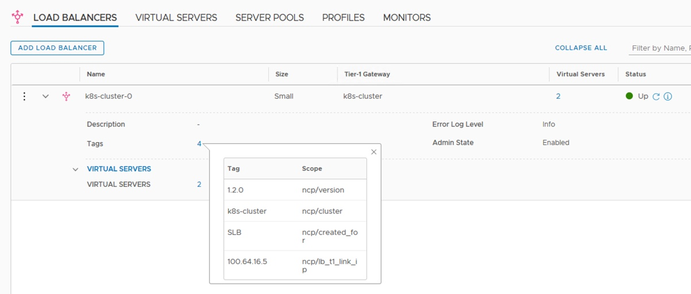
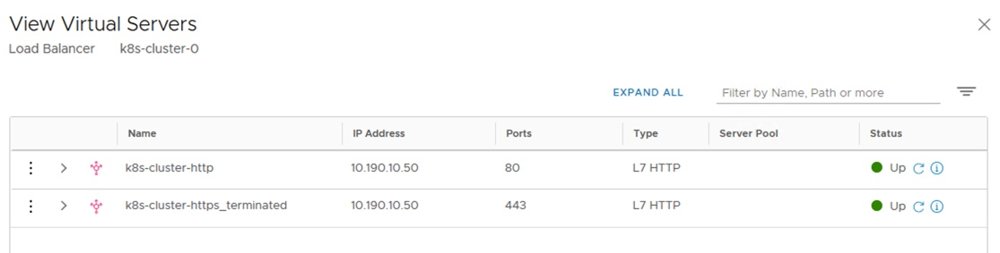
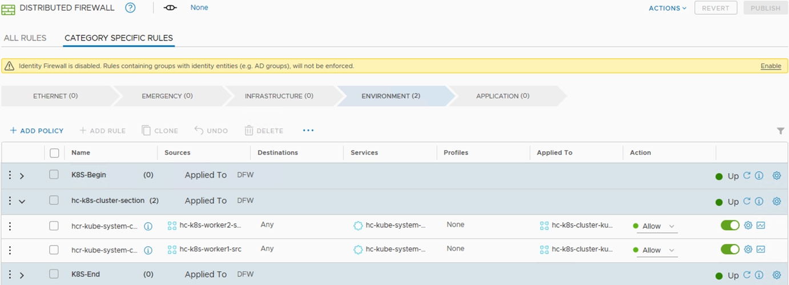

# NSX-T 2.5.x & K8S  - PART 4
[Home Page](https://github.com/dumlutimuralp/k8s-with-nsx-t-2.5.x)

# Table of Contents
[Deploying NSX Components in K8S Cluster](#Deploying-NSX-Components-in-K8S-Cluster)  
[Creating Namespace and Deploying Test Workloads](#Creating-Namespace-and-Deploying-Test-Workloads)  
[Troubleshooting](#Troubleshooting)

# Deploying NSX Components in K8S Cluster
[Back to Table of Contents](https://github.com/dumlutimuralp/k8s-with-nsx-t-2.5.x/tree/master/Part%204#Table-of-Contents)

1. Copy the "nsx-ncp-ubuntu-2.5.0.14628220.tar" file (located in the Kubernetes folder of the .zip file downloaded from my.vmware.com) to a folder on each K8S node. This file is the container image file that is used for containers in the NSX Node Agent Pod and also NSX NCP Bootstracp Pod.  

Hint : Winscp is a handy tool for file copying from Windows to Linux.  

2. On each K8S node, at the prompt, run the <b>"sudo docker load -i nsx-ncp-ubuntu-2.5.0.14628220.tar"</b> command to load the container image to the local Docker container image repository on each K8S node. (This command needs to be run in the same folder which the container image file was copied to on the K8S node) 

3. On each K8S node, tag the image by running <b>"sudo docker tag registry.local/2.5.0.14628220/nsx-ncp-ubuntu:latest nsx-ncp"</b> . This is needed as the container image name used in the manifest file (edited back in Part 3) is pointing out to the container image name of "nsx-ncp". Verify that the image is correctly renamed by running <b>"sudo docker images"</b>.

<pre><code>
root@k8s-master:~# <b>sudo docker images</b>
REPOSITORY                           TAG                 IMAGE ID            CREATED             SIZE
k8s.gcr.io/kube-proxy                v1.14.9             636041c2a488        5 weeks ago         82.1MB
k8s.gcr.io/kube-apiserver            v1.14.9             5811259ed0c9        5 weeks ago         209MB
k8s.gcr.io/kube-controller-manager   v1.14.9             07193a77f264        5 weeks ago         157MB
k8s.gcr.io/kube-scheduler            v1.14.9             0f036524b7a2        5 weeks ago         81.6MB
<b>nsx-ncp</b>                              latest              40aae9a4aeda        3 months ago        744MB
k8s.gcr.io/coredns                   1.3.1               eb516548c180        11 months ago       40.3MB
k8s.gcr.io/etcd                      3.3.10              2c4adeb21b4f        12 months ago       258MB
k8s.gcr.io/pause                     3.1                 da86e6ba6ca1        24 months ago       742kB
root@k8s-master:~#
</code></pre>

4. On K8S master node, from the folder where the "ncp-ubuntu.yaml" was copied to in the node (in the previous post), run "sudo kubectl apply -f ncp-ubuntu.yaml". This command will create a namespace as "nsx-system" in the K8S cluster, then associate a few services accounts and cluster roles in that namespace, then create NCP deployment, NSX NCP Bootstracp daemonset, NSX Node Agent daemonset. 

All of the above can be verified by running "sudo kubectl get all -n nsx-system". As shown below.

<pre><code>
root@k8s-master:~# sudo kubectl get all -n nsx-system
NAME                           READY   STATUS    RESTARTS   AGE
pod/nsx-ncp-848cc8c8ff-k6vfg   1/1     Running   0          13d
pod/nsx-ncp-bootstrap-4mxj5    1/1     Running   0          14d
pod/nsx-ncp-bootstrap-72lvg    1/1     Running   0          14d
pod/nsx-ncp-bootstrap-s5zv4    1/1     Running   0          14d
pod/nsx-node-agent-5xtm4       3/3     Running   0          14d
pod/nsx-node-agent-68ls8       3/3     Running   0          14d
pod/nsx-node-agent-bbpjm       3/3     Running   0          14d

NAME                               DESIRED   CURRENT   READY   UP-TO-DATE   AVAILABLE   NODE SELECTOR   AGE
daemonset.apps/nsx-ncp-bootstrap   3         3         3       3            3           <none>          14d
daemonset.apps/nsx-node-agent      3         3         3       3            3           <none>          14d

NAME                      READY   UP-TO-DATE   AVAILABLE   AGE
deployment.apps/nsx-ncp   1/1     1            1           14d

NAME                                 DESIRED   CURRENT   READY   AGE
replicaset.apps/nsx-ncp-848cc8c8ff   1         1         1       14d
root@k8s-master:~#
</code></pre>

<b>Note :</b> If any of the Pods, in the above output, show up in "CrashLoopBackOff" status then the logs of the respective container in the respective Pod can be investigated. Please refer to [Troubleshootng](?????) section for more information.

At this stage let' s revisit the topology that was shown in previous posts.

Since a K8S cluster comes with multiple namespaces (kube-system, default etc.) and K8S services (kubernetes API, DNS etc.) by default, for these K8S constructs it is expected to have the corresponding NSX-T constructs created automaticaly by NCP. (NCP is the Pod running with the name "nsx-ncp-848cc8c8ff-k6vfg" (in the previous output) in this demonstration. 

Let' s check what has changed on NSX-T side.

A new Tier 1 Gateway has been provisioned with the name "k8s-cluster".

Five new segments are provisioned (one per K8S namespace) on the Tier 1 gateway. 

IP Pool/address space for each K8S namespace is automatically carved out from the respective IP Block.

A new load balancer is provisioned and attached to the Tier 1 Gateway.

The VIP for the K8S ingress (Layer 7 LB) is automatically provisioned. The IP adress of the VIP is picked from the "K8S-LB-POOL" automatically.

Two firewall rules are automatically provisioned between the sections that were manually configured before (K8S-Begin and K8S-End) . These firewall rules are for K8S node healthcheck traffic destined for CoreDNS Pods.

# Creating Namespace and Deploying Test Workloads
[Back to Table of Contents](https://github.com/dumlutimuralp/k8s-with-nsx-t-2.5.x/tree/master/Part%204#Table-of-Contents)

Let' s create a new K8S namespace in this K8S cluster and push a deployment that contains three replicas in it. Following manifest will be used for this purpose. In the siimplest form, this manifest creates a namespace, then creates a deployment with a replicaset which contains three replica Pods of "nsxdemo" image.

<pre><code>
apiVersion: v1
kind: Namespace
metadata:
 name: demons
---
apiVersion: apps/v1
kind: Deployment
metadata:
  name: nsxdemo
  namespace: demons
spec:
  selector:
    matchLabels:
      app: nsxdemoapp
  replicas: 3
  template:
    metadata:
      labels:
        app: nsxdemoapp
    spec:
      containers:
      - name: nsx-demo
        image: dumlutimuralp/nsx-demo
        ports:
        - containerPort: 80
</code></pre>

Save the content above in a demo.yaml file on the K8S master node and in the same folder run below command.

<pre><code>
root@k8s-master:~# <b>sudo kubectl create -f demo.yaml</b>
namespace/demons created
deployment.apps/nsxdemo created
root@k8s-master:~#
</code></pre>

Let' s check what has changed in the K8S cluster.

<pre><code>
root@k8s-master:~# sudo kubectl get ns
NAME              STATUS   AGE
default           Active   15d
<b>demons            Active   5m17s</b>
kube-node-lease   Active   15d
kube-public       Active   15d
kube-system       Active   15d
nsx-system        Active   14d
</code></pre>

# Troubleshooting
[Back to Table of Contents](https://github.com/dumlutimuralp/k8s-with-nsx-t-2.5.x/tree/master/Part%204#Table-of-Contents)

